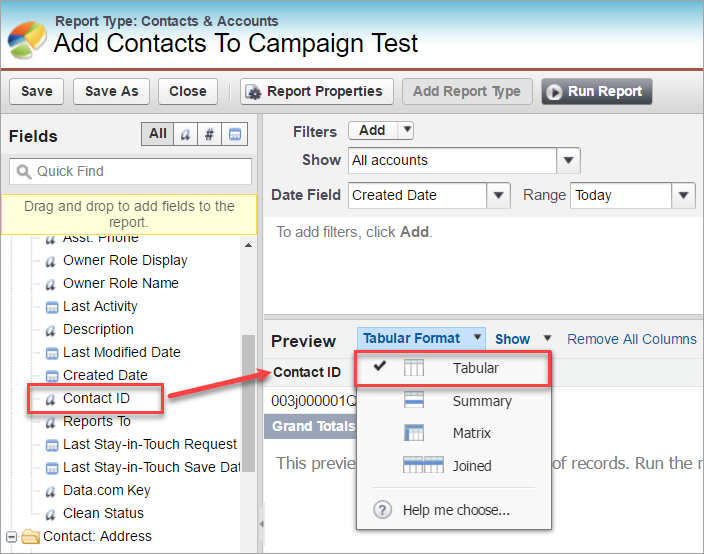
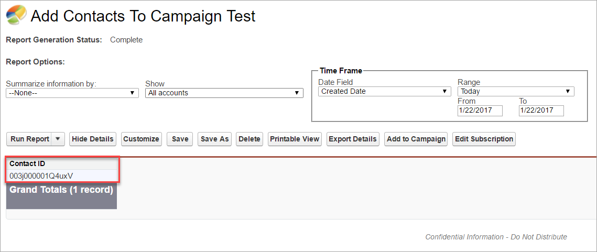
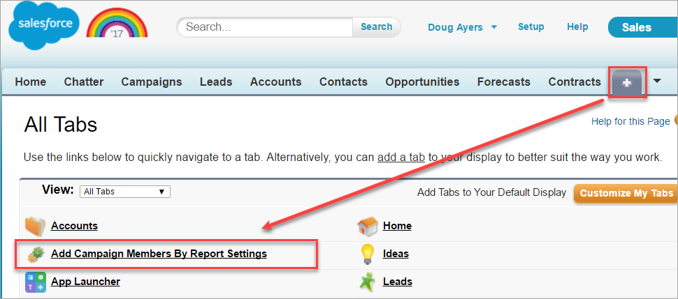

Automate Adding Contacts and Leads as Campaign Members By Report
================================================================

Overview
--------

Save time and effort and avoid data loads by automatically adding contacts and leads to your campaigns based on reports.

Use reports to segment and filter the leads and contacts that matter to you then use either Report Subscriptions or Scheduled Jobs to automate adding those records to your campaigns. You can even specify the default campaign member status to use when adding the members.

Installation
------------

Two options. You may install the unmanaged code from GitHub and make any desired adjustments. You are responsible for ensuring unit tests meet your org's validation rule and other requirements. You may also install this solution as a managed package. You can't customize the code but you don't have to worry about unit tests or code coverage!

* [Deploy from Github](https://githubsfdeploy.herokuapp.com) (unmanaged)
* Install Managed Package (Release 1.4)
    * [Production](https://login.salesforce.com/packaging/installPackage.apexp?p0=04t46000000E13M)
    * [Sandbox](https://test.salesforce.com/packaging/installPackage.apexp?p0=04t46000000E13M)

Getting Started
---------------

1) Deploy code using link above.

2) Assign yourself the permission set named **Add Campaign Members By Report Admin**. This grants you access to Visualforce pages developed to let you easily manage the custom setting (selecting campaign, selecting report, selecting column from report). Otherwise by doing it manually in **Setup | Develop | Custom Settings** requires you to know all the underlying record IDs and details about Report Metadata.

3) Create a report in `Tabular` format that contains at least one **Contact ID** or **Lead ID** field. The field must be either the record ID or a lookup to the object holding the ID value, it cannot be a `text` or `formula` field. Please note, `Summary`, `Matrix` or other complex report formats are not supported by this package at this time.

4) Create an active Campaign that you want the contacts/leads from the report to be added to as members whenever the report runs.

5) Navigate to the tab **Add Campaign Members By Report Settings**. This will list any existing custom settings, which you may edit or delete as needed. Click the **New** button to create a new configuration for our report (step 3) and campaign (step 4).

6) Go back and run your report from step 3. On the report results page, click on the `Subscribe` button. It should appear just after the `Add to Campaign` button. Ironically enough, this solution has nothing to do with the `Add to Campaign` button -- though you're welcome to use that button to manually add contacts to your campaigns. But if you're still interested in automating the process, keep reading because you're almost done!

7) To test the subscription, click the **Save & Run Now** button. If successful then your campaign should now include all the contacts/leads from the report. If you've maxed out your number of report subscriptions, see the FAQ below for how to schedule the report with Apex instead.

* Note, it may take a moment depending on how many records are in your report.
* For small reports (less than 200 records) it may complete in a couple seconds.
* For large reports (more than 2,000 records) it may take a few moments until all campaign members are added.
* You will notice progress nearly immediately as the batch background job runs.

FAQ
===

Do I need to install the Non-Profit Starter Pack?
-------------------------------------------------

No, this package uses a copy of the [SalesforceFoundation](https://github.com/SalesforceFoundation) [ReportService](https://github.com/SalesforceFoundation/CampaignTools/blob/master/src/classes/ReportService.cls) as part of their [CampaignTools](https://github.com/SalesforceFoundation/CampaignTools) package to support all records in a report beyond the 2,000 limit. I have included the two apex classes needed in this package. Just let the Salesforce Foundation know we appreciate them!

Can I use other report types other than the standard "Contacts & Accounts" or "Leads"?
--------------------------------------------------------------------------------------

Yes! You can use any standard or custom report type provided that one of the columns in the report is either the Contact.Id, Lead.Id, or a lookup to the Contact or Lead objects. The column cannot simply be a `text` or `formula` field, however.

For example, you could use **Opportunities with Contact Roles** report type and include the **Contact ID** field on the report.

I have reached the limit of number of reports I can subscribe to, what can I do?
--------------------------------------------------------------------------------

At the time of this writing there is a limit of 5 reports any given user can [subscribe](https://help.salesforce.com/articleView?id=reports_subscribe_overview.htm&type=0&language=en_US&release=206.5) to at a time.

Alternatively, you can [schedule a job](https://developer.salesforce.com/docs/atlas.en-us.apexcode.meta/apexcode/apex_scheduler.htm) to run periodically that will automatically run the reports for you. It's about as simple or simpler to do than setting up the **report subscription** you just need to do it in the [Developer Console](https://developer.salesforce.com/docs/atlas.en-us.apex_workbook.meta/apex_workbook/apex1_2.htm) to run the below snippet:

    // schedule job to run at 3am every day
    String cron = '0 0 3 * * ?';
    System.schedule( 'AddCampaignMembersJob-' + DateTime.now().getTime(), cron, new AddCampaignMembersByReportSchedulable() );

Please consider voting for these ideas to increase the report subscription limit:
* [Increase the limit on the number of reports a user can subscribe to](https://success.salesforce.com/ideaView?id=08730000000DkodAAC)
* [Increase Report Subscription Notifications](https://success.salesforce.com/ideaView?id=08730000000wk37AAA)
